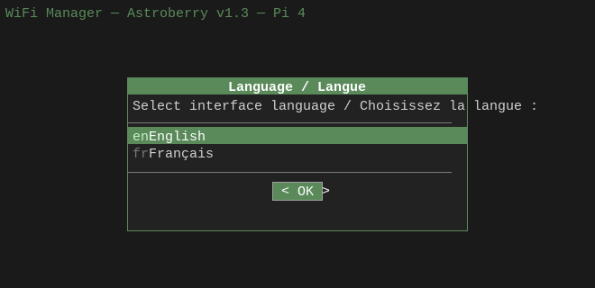
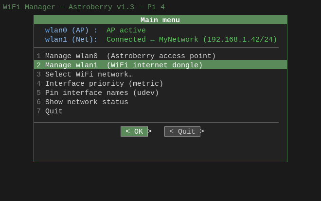
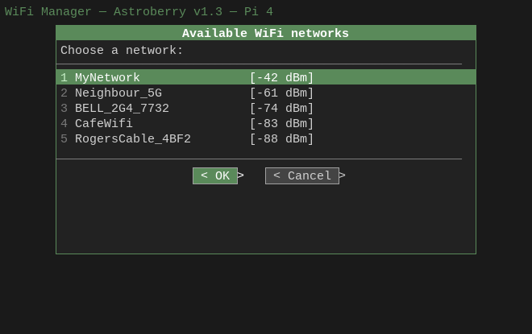
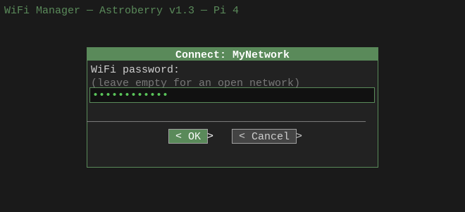
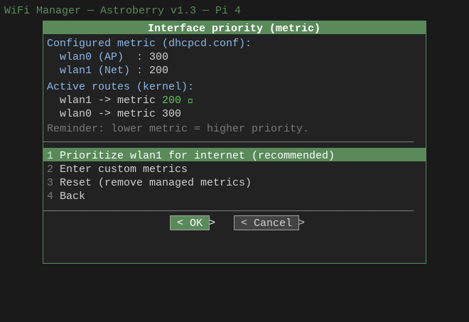
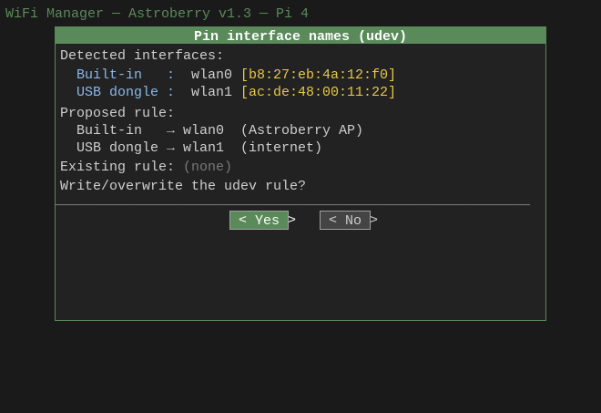
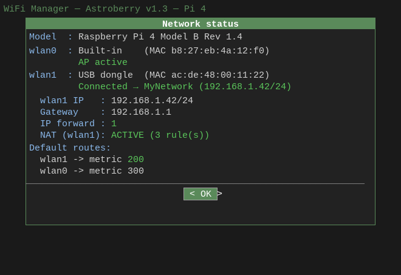
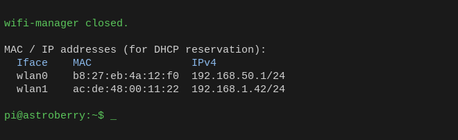

# wifi-manager — Technical Documentation

**Target platform:** Raspberry Pi 4 / Pi 5 running Astroberry  
**AI disclaimer:** The scripts and the doc were generated by Claude Sonnet 4.6 and Opus 4.8   
---

## 0. Quick Start

1. Copy `wifi-manager-nodialog.sh` on the astroberry.
2. make the script executable: `chmod +x ./wifi-manager-nodialog.sh`
3. `sudo bash ./wifi-manager-nodialog.sh`

The motto is: _It Worked On My PC (and it is AI-generated)_ ... Feedback is welcomed !

The dialog-based version is a cuter version, which requires dependencies no installed by default on astroberry for RPi. You can use the nodialog version with no loss of fucntionality. 

---

## 1. Problem Statement

Astroberry is an astronomy-focused Raspberry Pi distribution built on Raspbian.
It runs a permanent WiFi access point on the built-in wireless chip so that
clients (laptops, phones) can connect to KStars/Ekos without any external
network infrastructure. The goal of this project is to add internet access
through a USB WiFi dongle while keeping that AP running at all times, and to
expose all management through a terminal user interface usable over SSH.

---

## 2. Script Versions

Three scripts are provided. They share identical network logic, Pi model
detection, i18n (English/French), and the on-exit MAC/IP summary. They differ
only in how the TUI is rendered and in configuration flexibility.

| File | Version | TUI engine | Config file | dialog required |
|---|---|---|---|---|
| `wifi-manager.sh` | 1.3 | `dialog` | No | Yes |
| `wifi-manager-nodialog.sh` | 2.1 | Pure bash (ANSI) | Yes | No |
| `wifi-manager.conf.example` | — | Config template | — | — |

### wifi-manager.sh (v1.3) — dialog version

The original script. All menus, message boxes, and input prompts are rendered
by the `dialog` utility, giving a classic ncurses-style UI with bordered windows
and highlighted selections. Interface names are hardcoded to `wlan0` (AP) and
`wlan1` (client).

Requires `dialog` and `iw` to be installed (neither ships with Astroberry by
default). See the offline installation note in section 2.5.

### wifi-manager-nodialog.sh (v2.1) — no-dialog version

A functionally identical rewrite that replaces every `dialog` call with plain
ANSI escape sequences and `read` prompts. Has zero extra dependencies beyond
bash and the networking tools already present on Astroberry. Adds full
config-file support: every tunable (interface names, country code, metrics,
NAT toggle, default language, file paths, timeouts) is overridable from
`/etc/wifi-manager.conf` (or a path supplied on the command line). Built-in
defaults are preserved, so it also runs with no config file at all.

### Choosing between the two

Use `wifi-manager.sh` if `dialog` is already installed and you prefer its
polished framed menus. Use `wifi-manager-nodialog.sh` if you need zero extra
dependencies, want config-file automation, or are packaging the script for
offline deployment.

---

## 2.1 Prerequisites

### dialog version (wifi-manager.sh)

Requires two packages that are not installed by default on Astroberry:

```bash
sudo apt update
sudo apt install dialog iw
```

All other dependencies (`wpa_supplicant`, `dhcpcd`, `hostapd`, `dnsmasq`,
`iptables`, `ip`, `udevadm`) are part of the standard Astroberry image.

### no-dialog version (wifi-manager-nodialog.sh)

Requires only `iw` for the WiFi scan (with `wpa_cli` as a fallback if `iw` is
absent). Everything else is already on Astroberry:

```bash
sudo apt install iw    # optional — wpa_cli fallback is used if absent
```

---

## 2.2 Installation

Copy the relevant script(s) to the Pi and make them executable:

```bash
# From your workstation over SSH — copy whichever scripts you need:
scp wifi-manager.sh              astroberry@astroberry.local:~/
scp wifi-manager-nodialog.sh     astroberry@astroberry.local:~/
scp wifi-manager.conf.example    astroberry@astroberry.local:~/

# On the Pi:
chmod +x ~/wifi-manager.sh ~/wifi-manager-nodialog.sh
```

---

## 2.3 Running the scripts

Both scripts must run as root because they control system services (`hostapd`,
`dhcpcd`, `dnsmasq`) and write to `/etc` and `/proc`.

### dialog version

```bash
sudo bash ~/wifi-manager.sh
# or, once made executable:
sudo ~/wifi-manager.sh
```

### no-dialog version — basic usage

```bash
sudo bash ~/wifi-manager-nodialog.sh
```

### no-dialog version — with a config file

```bash
# Use the default config location (/etc/wifi-manager.conf):
sudo bash ~/wifi-manager-nodialog.sh

# Use an explicit config file:
sudo bash ~/wifi-manager-nodialog.sh -c /path/to/my.conf

# Use an environment variable:
WIFI_MANAGER_CONF=/path/to/my.conf sudo bash ~/wifi-manager-nodialog.sh

# Show all options:
bash ~/wifi-manager-nodialog.sh --help
```

### Setting up the config file

```bash
# Install the documented template as the active config:
sudo cp wifi-manager.conf.example /etc/wifi-manager.conf
sudo chown root:root /etc/wifi-manager.conf
sudo chmod 644 /etc/wifi-manager.conf    # or 600 to hide from other users

# Edit as needed (everything is commented by default — safe to leave as-is):
sudo nano /etc/wifi-manager.conf
```

The script refuses to load the config if it is not owned by root or is writable
by group/other, to prevent privilege escalation. A world-writable or
non-root-owned config causes an immediate abort with a clear error message.

---

## 2.4 Typical first-run workflow

These steps are the same regardless of which script you use.

1. Run the script and select your language (English or Français).
2. Go to **Manage wlan1** → **Enable wlan1 dongle** to bring the USB adapter up.
3. Go to **Select WiFi network**, pick your network, enter the password.
4. Go to **Interface priority (metric)** and apply the recommended preset
   (client = 200, AP = 300) so the dongle is the preferred internet path.
5. Go to **Pin interface names (udev)** while both interfaces are present.
   Reboot once to make the names permanent and prevent boot-order swaps.
6. On subsequent boots, repeat steps 2–3 only (the client interface does not
   auto-connect unless `wpa_supplicant@wlan1.service` is enabled separately).

### Exit summary

When either script exits (Quit menu item, Ctrl-C, or any error), it clears
the screen and prints the MAC address and current IPv4 of both interfaces:

```
wifi-manager closed.

MAC / IP addresses (for DHCP reservation):
  Iface    MAC                IPv4
  wlan0    b8:27:eb:4a:12:f0  192.168.50.1/24
  wlan1    ac:de:48:00:11:22  192.168.1.42/24
```

Paste wlan1's MAC into your router's DHCP reservation table so the dongle
always gets the same IP. wlan0's address is the static AP address from
`dhcpcd.conf` and does not need a reservation.

### Log file

Both scripts log all operations with timestamps to `/var/log/wifi-manager.log`:

```bash
tail -f /var/log/wifi-manager.log
```

---

## 2.5 Install Dialog version (a cute TUI)

> **Note:** The Dialog-based version (`wifi-manager.sh`) provides the exact same
> features as the no-dialog version. The only difference is a beauti-ful TUI —
> bordered ncurses-style windows rendered by `dialog` instead of plain ANSI
> escape sequences.

Two sets of pre-downloaded packages are included in this repository for offline
installation of `dialog` and `iw` on Astroberry without any internet access on
the Pi.

### Method 1 — `dialog-offline/` (dpkg, works on a clean Astroberry install)

The `dialog-offline/` folder contains the required `.deb` files. Install them
directly with `dpkg`:

```bash
cd astroberry_wifi/dialog-offline
sudo dpkg -i *.deb
```

This method works from a clean Astroberry install with no additional tools
required.

### Method 2 — `apt-offline/` (apt-offline bundle)

The `apt-offline/` folder contains a `dialog-bundle.zip` file prepared with
`apt-offline`. Install it with:

```bash
sudo apt-offline install astroberry_wifi/apt-offline/dialog-bundle.zip
```

> **Note:** Although this method is cleaner (it goes through the full `apt`
> machinery), it requires the `apt-offline` package — which is **not** included
> by default on Astroberry. Use Method 1 if starting from a stock image.

---

## 3. TUI Screenshots (English — dialog version)

The dialog version renders ncurses-style bordered windows over the terminal,
fully usable over SSH. The language is selected once at startup.

**Screen 0 — Language selection**
Appears at startup before any other screen. Selection applies for the whole session.



**Screen 1 — Main menu**
The header refreshes on every loop, showing the live state of both interfaces.



**Screen 2 — WiFi network scan**
Networks are sorted by signal strength (strongest first). Up to 20 networks
are listed. `iw` is used as the primary scanner with `wpa_cli` as fallback.



**Screen 3 — Password entry**
Input is masked. Leave the field empty for open (no-password) networks.



**Screen 4 — Interface priority (metric)**
Shows both the configured values from `dhcpcd.conf` and the live values
currently applied in the kernel routing table side by side.



**Screen 5 — Pin interface names (udev)**
Detects both interfaces by hardware bus type (not by name), displays their
MACs, and writes a udev rule that makes the names permanent across reboots.



**Screen 6 — Network status**
Full diagnostic view: Pi model, physical interface type (built-in / USB dongle)
with MAC, connection state, IP addresses, gateway, IP forwarding flag, NAT rule
count, and live routing metrics.



**Screen 7 — Exit summary (terminal output)**
Printed to STDOUT after the TUI closes. Not a dialog screen — appears directly
in the terminal for easy copy-paste into a router's DHCP table.



---

## 4. Network Stack Research

### What Astroberry uses (confirmed)

Astroberry does **not** use NetworkManager. Its network stack is the classic
Raspbian combination:

| Component | Role |
|---|---|
| `hostapd` | Creates and manages the WiFi access point on wlan0 |
| `dnsmasq` | Provides DHCP and DNS to AP clients |
| `dhcpcd` | Assigns IP addresses to all interfaces, manages routes |
| `wpa_supplicant` | Handles WPA/WPA2 association for client-mode interfaces |

The AP interface (wlan0) is excluded from wpa_supplicant by the directive
`nohook wpa_supplicant` in `/etc/dhcpcd.conf`. This is what keeps hostapd from
conflicting with wpa_supplicant on the same interface.

### Key constraint

wpa_supplicant must be started as a **separate process bound only to the client
interface**, using its own configuration file. It must never be invoked in a way
that could interfere with the AP interface's hostapd-managed state.

### Per-interface wpa_supplicant config files

Research into the dhcpcd hook system confirmed that wpa_supplicant config files
named `/etc/wpa_supplicant/wpa_supplicant-<iface>.conf` are picked up by the
dhcpcd hook automatically for that specific interface. The scripts use this
convention, creating the file on first run if absent (chmod 600).

### Routing priority (metric)

dhcpcd assigns each interface's default route a routing metric. The kernel uses
the lowest metric as the preferred path. With two WiFi interfaces active, the
metric values determine which one carries internet traffic. This is controllable
through per-interface `metric` stanzas in `/etc/dhcpcd.conf`.

### Interface name stability risk

If the USB dongle is already plugged in when the Pi boots, the kernel's
interface naming may assign it `wlan0` and the built-in chip `wlan1`. This
swaps the AP and client roles, breaking Astroberry's access point. The fix is a
udev rule that pins each interface's name to its MAC address, which is
invariant.

---

## 5. Raspberry Pi Hardware Differences (Pi 4 vs Pi 5)

### Pi 4

The built-in WiFi chip (Cypress CYW43455) is connected to the SoC via the SDIO
bus. Its `/sys/class/net/<iface>/device` symlink resolves to a path containing
`mmc` or `sdio`.

### Pi 5

The built-in WiFi chip uses a different bus (platform bus). The `/sys` device
path contains neither `mmc` nor `sdio`, which would cause a naive Pi-4-only
detection to misclassify it as `unknown`.

### Detection strategy adopted

The script reads the authoritative Device Tree model string from
`/proc/device-tree/model` (NUL-terminated, stripped with `tr -d '\0'`), with a
fallback to the `Model` field in `/proc/cpuinfo`. This populates two global
variables:

- `PI_MODEL` — full string (e.g. "Raspberry Pi 5 Model B Rev 1.0")
- `PI_GEN` — `"4"`, `"5"`, `"other"`, or `"unknown"`

For bus detection, the script uses inverted logic that is robust across both
generations: **"if the /sys device path exists and does not contain `/usb`, the
interface is built-in"**. A Pi has exactly one soldered WiFi chip, so anything
not on the USB bus must be that chip. The explicit `mmc`/`sdio` check is
retained as a fast-path for the Pi 4; the fallback covers the Pi 5.

---

## 6. Implementation Details

### 6.1 File layout

| File | Purpose |
|---|---|
| `wifi-manager.sh` | dialog-based TUI script (v1.3) |
| `wifi-manager-nodialog.sh` | Pure-bash TUI script (v2.1) |
| `wifi-manager.conf.example` | Documented config template for the no-dialog version |
| `/etc/wifi-manager.conf` | Active config file (no-dialog version; created from the template) |
| `/etc/wpa_supplicant/wpa_supplicant-<client>.conf` | wpa_supplicant config for the client interface, created by the script if absent |
| `/etc/dhcpcd.conf` | Modified in-place to add managed metric blocks |
| `/etc/dhcpcd.conf.wifimgr.bak` | One-time backup of dhcpcd.conf taken before the first metric write |
| `/etc/udev/rules.d/70-persistent-wifi.rules` | Persistent interface naming rules, written by the TUI |
| `/var/run/wpa_supplicant_<client>.pid` | PID file for the client wpa_supplicant process |
| `/var/run/wifi-manager.lock` | Lock file preventing concurrent instances |
| `/var/log/wifi-manager.log` | Timestamped operational log |

### 6.2 Config file (no-dialog version only)

The config file is sourced as bash, which allows shell expressions but also
means it can execute arbitrary code. The script refuses to load it unless it is
owned by root (uid 0) and not writable by group/other — this prevents an
unprivileged user from injecting code that would run with root privileges.

After sourcing, `validate_config` rejects malformed values (non-numeric metrics,
invalid country codes, identical interface names, etc.) with a clear message
before any network operation runs. `derive_paths` then auto-fills the
wpa_supplicant conf and PID file paths from the (possibly overridden) interface
name, unless the user has set them explicitly.

Configurable variables:

| Variable | Default | Description |
|---|---|---|
| `IFACE_AP` | `wlan0` | AP / built-in interface |
| `IFACE_CLIENT` | `wlan1` | Client / USB dongle interface |
| `WIFI_COUNTRY` | `CA` | 2-letter ISO country code |
| `WPA_DRIVER` | `nl80211,wext` | wpa_supplicant -D driver string |
| `CONNECT_TIMEOUT` | `15` | Seconds to wait for association |
| `DEFAULT_METRIC_AP` | `300` | dhcpcd metric for the AP interface |
| `DEFAULT_METRIC_CLIENT` | `200` | dhcpcd metric for the client interface |
| `ENABLE_NAT` | `yes` | Whether to set up NAT for AP clients |
| `DEFAULT_LANG` | `ask` | `ask`, `en`, or `fr` |
| `WPA_CONF_DIR` | `/etc/wpa_supplicant` | Directory for wpa_supplicant files |
| `WPA_CONF_CLIENT` | _(derived)_ | Full path to the client's wpa_supplicant file |
| `WPA_PID_CLIENT` | _(derived)_ | PID file for the client's wpa_supplicant |
| `DHCPCD_CONF` | `/etc/dhcpcd.conf` | Path to dhcpcd.conf |
| `UDEV_RULES` | `/etc/udev/rules.d/70-persistent-wifi.rules` | udev naming rule file |
| `LOG_FILE` | `/var/log/wifi-manager.log` | Operational log |
| `LOCK_FILE` | `/var/run/wifi-manager.lock` | Single-instance lock |

### 6.3 AP interface management

`enable_ap` starts `hostapd`, `dnsmasq`, and restarts `dhcpcd` via
`systemctl`. `disable_ap` reverses this and brings the AP interface down. Both
are wrapped in a TUI screen with a mandatory confirmation before disable, since
disabling the AP disconnects all remote clients.

### 6.4 Client interface management

`enable_client`:
1. Calls `init_wpa_conf_client` to create the wpa_supplicant config if absent.
2. Brings the client interface up with `ip link set <iface> up`.
3. Kills any existing wpa_supplicant process bound to the client interface.
4. Launches `wpa_supplicant -B -D <driver> -i <iface> -c <conf> -P <pid>`.
5. Calls `dhcpcd <iface>` to obtain an IP.
6. Calls `enable_nat` (skipped if `ENABLE_NAT=no`).

`disable_client` reverses: releases the dhcpcd lease, kills wpa_supplicant via
PID file (then falls back to `pkill`), brings the interface down, calls
`disable_nat`.

### 6.5 NAT / internet sharing

When the client interface connects, AP clients reach the internet through NAT:

```
AP clients → IFACE_AP → [iptables FORWARD] → IFACE_CLIENT → internet
```

`enable_nat`:
- Sets `/proc/sys/net/ipv4/ip_forward` to 1.
- Appends `net.ipv4.ip_forward=1` to `/etc/sysctl.conf` if not already present.
- Adds `iptables -t nat -A POSTROUTING -o <client> -j MASQUERADE`.
- Adds two FORWARD rules (established+related in, all out).

All iptables calls check for the rule's existence with `-C` before adding with
`-A` to avoid duplicate entries. `disable_nat` removes all three rules and sets
`ip_forward` back to 0. In the no-dialog version, `ENABLE_NAT=no` skips
`enable_nat`/`disable_nat` entirely and shows "disabled (config)" on the
status screen.

### 6.6 Routing metric management

Metrics are written to `/etc/dhcpcd.conf` as fenced blocks:

```
# >>> wifi-manager metric: wlan1 >>>
interface wlan1
metric 200
# <<< wifi-manager metric: wlan1 <<<
```

The fence markers let `sed -i` surgically delete and replace only the managed
block on subsequent writes, leaving all other dhcpcd.conf content untouched.
After any metric change, `systemctl restart dhcpcd` applies the new values.

Three options are offered:
1. Apply the recommended preset (client=200, AP=300).
2. Enter custom values with numeric validation.
3. Remove all managed blocks and restore dhcpcd defaults.

### 6.7 Persistent interface naming (udev)

`find_builtin_iface` and `find_usb_iface` classify wireless interfaces by their
hardware bus type (USB vs built-in), not by their current name. The TUI screen
displays what was detected (name + MAC) before asking for confirmation, refuses
to proceed if either interface is absent, and writes a udev rule file that
targets the configured names (`IFACE_AP` / `IFACE_CLIENT` in the no-dialog
version). `udevadm control --reload-rules` is called immediately, but the name
change takes effect only at the next boot.

### 6.8 WiFi network scan and connection

`scan_networks` uses `iw dev <iface> scan` as the primary method (sorted by
signal level descending, top 20), falling back to `wpa_cli scan` +
`wpa_cli scan_results`. `connect_network` uses the wpa_cli programmatic
interface: `add_network` → `set_network ssid/psk` (or `key_mgmt NONE` for open
networks) → `enable_network` → `save_config` → `select_network`. It then polls
`wpa_cli status` every second for up to `CONNECT_TIMEOUT` seconds waiting for
`wpa_state=COMPLETED`, then requests an IP via `dhcpcd` and calls `enable_nat`.

### 6.9 Internationalization (i18n)

All user-facing strings live in two parallel associative arrays (`MSG_FR` and
`MSG_EN`). The language is chosen once at startup (or preset via `DEFAULT_LANG`
in the no-dialog version) and stored in `UI_LANG`. Two helpers read from the
active table:

- `t key` — returns a plain string, preserving literal `\n` for line breaks.
- `tf key arg…` — fills `%s` placeholders via printf.

The fallback chain is EN → FR → the raw key name, so no string ever renders
blank. All log messages and code comments stay in English regardless of
`UI_LANG`.

### 6.10 Exit summary

`print_iface_summary` is called from the `cleanup` trap (which fires on every
exit path). It reads the MAC from `/sys/class/net/<iface>/address` and the IPv4
from `ip -4 addr show`, then prints an aligned three-column table (Iface / MAC /
IPv4) to STDOUT. Missing interfaces print `(absent)` and missing IPs print `-`.
The header line is localized; the table body is neutral.

### 6.11 Safety guards (both scripts)

- `set -euo pipefail` — abort on any unhandled error, undefined variable, or
  pipe failure.
- Lock file with live PID check — prevents two instances running simultaneously.
- `trap cleanup EXIT` — removes the lock file, clears the terminal, and prints
  the MAC/IP summary on any exit path.
- `log` uses `|| true` — never terminates the script due to a log write failure.
- All iptables additions are idempotent (pre-checked with `-C`).
- dhcpcd.conf is backed up before first write; managed blocks are fenced so
  user content is never overwritten.
- Disabling the AP requires explicit confirmation.
- Startup emits a warning if `PI_GEN` is neither `"4"` nor `"5"`, and a
  separate warning if no USB dongle is detected.

### 6.12 Additional safety guards (no-dialog version only)

- Config file ownership and permission check before sourcing (must be root-owned,
  not group/other-writable).
- `validate_config` rejects malformed values before any network operation.
- `parse_args` handles `-c/--config` and `-h/--help`; unknown options exit 2.
- `ENABLE_NAT=no` disables NAT unconditionally regardless of TUI state.
- All interface-specific commands use `$IFACE_AP`/`$IFACE_CLIENT` variables
  rather than hardcoded names throughout.

---

## 7. TUI Structure

Both scripts expose the same menu tree. The dialog version uses framed windows;
the no-dialog version prints numbered lists with ANSI color.

```
Language picker  (startup only — skipped if DEFAULT_LANG=en or fr)
│
Main menu  [live status of both interfaces refreshed on each loop]
├── 1. Manage AP interface
│       ├── Enable AP (hostapd + dnsmasq)
│       └── Disable AP  [confirmation required]
├── 2. Manage client interface (dongle)
│       ├── Enable dongle
│       ├── Select WiFi network…  ──→ scan → list → password → connect
│       └── Disable dongle
├── 3. Select WiFi network…       (shortcut — same flow as above)
├── 4. Interface priority (metric)
│       ├── Apply recommended preset
│       ├── Enter custom values
│       └── Reset (remove managed blocks)
├── 5. Pin interface names (udev)
│       └── Detect by bus → show MACs → confirm → write rule
└── 6. Network status
        (Pi model, physical type + MAC per interface, IP, gateway,
         ip_forward, NAT state, live routing metrics)

On exit (any path) → MAC/IP summary printed to STDOUT
```

---

## 8. Dependencies

### dialog version (wifi-manager.sh)

| Package | Used for | Pre-installed on Astroberry |
|---|---|---|
| `dialog` | All TUI screens | No — must install |
| `iw` | WiFi scan (primary) | No — must install |
| `wpa_supplicant` / `wpa_cli` | WPA2 association | Yes |
| `dhcpcd` | IP assignment, metric config | Yes |
| `hostapd` | Access point management | Yes |
| `dnsmasq` | DHCP/DNS for AP clients | Yes |
| `iptables` | NAT masquerading | Yes |
| `ip` | Interface state, routing table | Yes |
| `udevadm` | Reload udev rules | Yes |

```bash
sudo apt install dialog iw
```

### no-dialog version (wifi-manager-nodialog.sh)

| Package | Used for | Pre-installed on Astroberry |
|---|---|---|
| `iw` | WiFi scan (primary; wpa_cli fallback if absent) | No — recommended |
| `wpa_supplicant` / `wpa_cli` | WPA2 association; scan fallback | Yes |
| `dhcpcd` | IP assignment, metric config | Yes |
| `hostapd` | Access point management | Yes |
| `dnsmasq` | DHCP/DNS for AP clients | Yes |
| `iptables` | NAT masquerading | Yes |
| `ip` | Interface state, routing table | Yes |
| `udevadm` | Reload udev rules | Yes |
| `bash` | Script runtime + entire TUI | Yes |

```bash
sudo apt install iw    # recommended but not strictly required
```

---

## 9. Known Limitations

- **Pi 5 not hardware-tested.** The bus-detection logic is correct by reasoning
  but has not been validated on physical Pi 5 hardware. The status screen shows
  the detected physical type so any misclassification is immediately visible.
- **Client interface does not auto-connect at boot.** The scripts manage
  wpa_supplicant manually. To connect automatically on boot, either run a script
  at startup or enable `wpa_supplicant@<iface>.service` separately.
- **iptables only (no nftables).** Astroberry/Raspbian Buster-era images use
  iptables. On newer Bookworm-based images nftables is the default; the NAT
  rules would need adaptation.
- **No iptables persistence across reboots.** NAT rules are re-applied each time
  `enable_client` is called. Configure `iptables-persistent` separately if
  needed.
- **Country code defaults to CA.** The no-dialog version exposes this as
  `WIFI_COUNTRY` in the config file. The dialog version's generated
  wpa_supplicant file uses `country=CA` and must be edited manually if needed.
- **Dialog version has hardcoded interface names.** `wlan0`/`wlan1` are fixed in
  `wifi-manager.sh`. Use `wifi-manager-nodialog.sh` with a config file if you
  need different interface names.